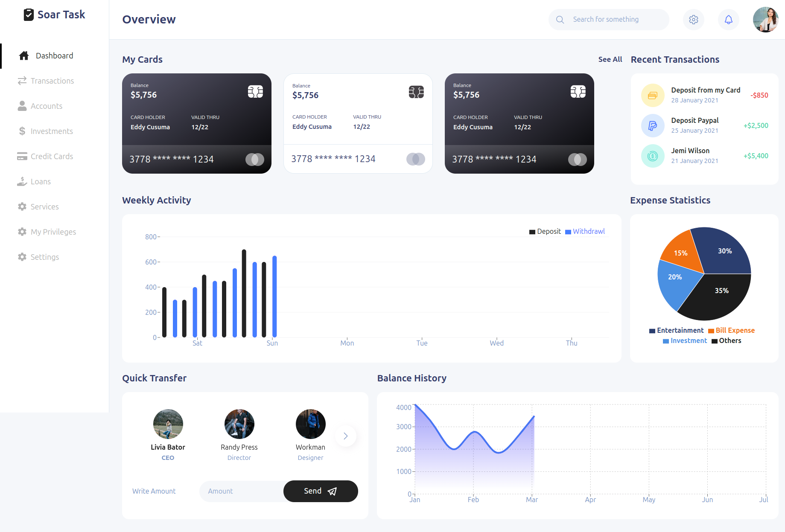
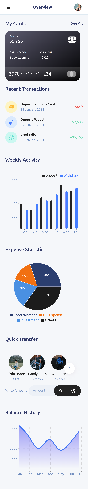
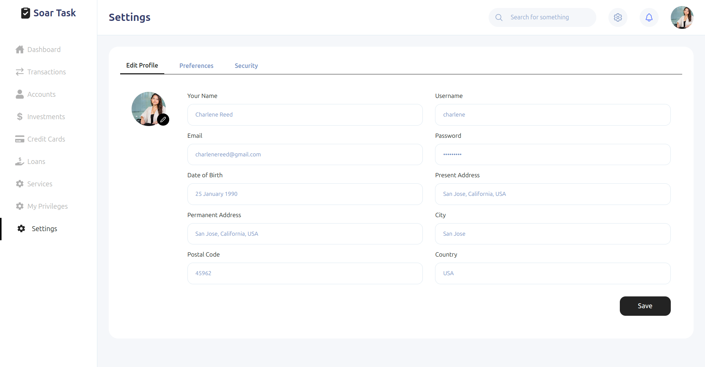
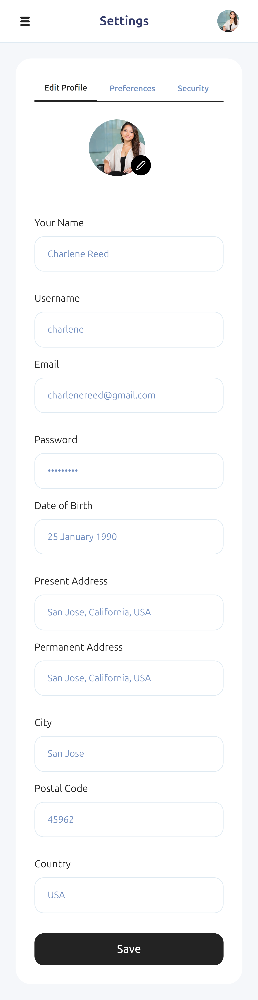

# React Admin Dashboard

A user-friendly admin dashboard for financial sector, offering key features such as an account overview component and a settings page that allows users to easily update their profile and preferences.

## Getting Started

### Prerequisites

- Node.js(LTS) and npm installed

### Installation

1. Clone the repository
```bash
git clone https://github.com/knav33n/admin-dashboard
```

2. Navigate to the project directory
```bash
cd admin-dashboard
```

3. Install dependencies
```bash
npm install
```

4. Start the development server
```bash
npm run dev
```

5. Open http://localhost:5173 in your browser to view the application

## Screenshot

*Overview*


*Overview Mobile*


*Settings*


*Settings Mobile*

## Technologies Used

- React
- Typescript
- Tailwind CSS
- React Router
- React Icons
- Recharts